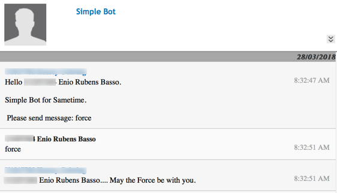
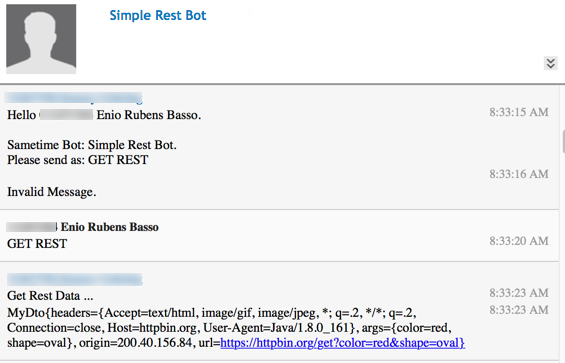
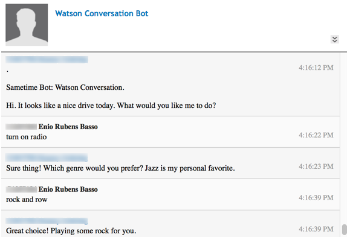
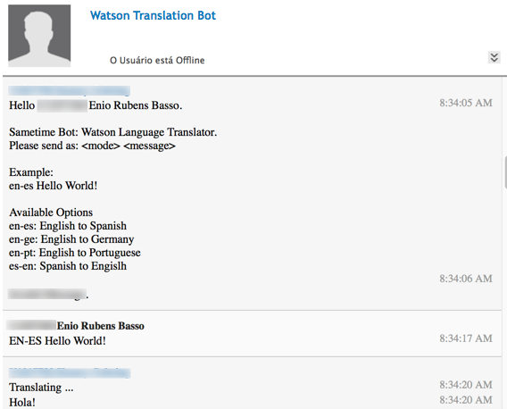

# ibm-sametime-bots
Bots using IBM Sametime. As client to REST Web Services and Watson Cognitive Services.

## Bots

| Application                 |   Description                                                                 | 
|-----------------------------|-------------------------------------------------------------------------------|
| SimpleBot                   | Simple Bot example                                                            |
| SimpleRestBot               | This Bot queries a site for information and return result (Json) to partner   |
| WatsonConversationBot       | This Bot use Watson Conversation service to demonstrates the Conversation service in a Sametime chat interface simulating a cognitive car dashboard.         |
| WatsonLanguageTranslatorBot | This Bot use IBM Watson Language Translator service to do text translation    |

Binary version at [bin](https://github.com/ebasso/ibm-sametime-bots/tree/master/bin) directory

### Simple Bot



### Simple Rest Bot



### Watson Conversation Bot



### Watson Languate Translator Bot



# WatsonConversationBot - Conversation Sample Application using IBM Sametime

This Bot application demonstrates the Conversation service in a Sametime chat interface simulating a cognitive car dashboard.

See [Demo: Car Dashboard](https://watson-assistant-demo.ng.bluemix.net/)

## Before you begin

* Create a Bluemix account
    * [Sign up](https://console.ng.bluemix.net/dashboard/services) in Bluemix, or use an existing account.

* Make sure that you have the following prerequisites installed:
    * The [Java 8](https://java.com/download) runtime

### Getting the files

Use GitHub to clone the repository locally, or [download the .zip file](https://github.com/ebasso/ibm-sametime-bots/archive/master.zip) of the repository and extract the files.

## Importing the Conversation workspace

More details [Watson Assistant - Getting started tutorial](https://console.bluemix.net/docs/services/conversation/getting-started.html)

1. In your browser, navigate to [your Bluemix console] (https://console.ng.bluemix.net/dashboard/services).

1. On Bluemix catalog, created Conversation service.

1. From the **All Items** tab, click the newly created Conversation service in the **Services** list.

1. On the Service Details page, click **Launch tool**.

1. Click the **Import workspace** icon in the Conversation service tool. Specify the location of the workspace JSON file in your local copy of the app project:

    `<project_root>/training/car_workspace.json`

1. Select **Everything (Intents, Entities, and Dialog)** and then click **Import**. The car dashboard workspace is created.

After make note of **Username, Password and WorkspaceID**

## Configure WatsonLanguageTranslatorBot.properties

On file **WatsonLanguageTranslatorBot.properties** update 

```
conversation.username=<conversation username>
conversation.password=<password>
conversation.workspaceid=<workspace id>
```

## Testing

Run WatsonLanguageTranslatorBot inside your Java IDE or by command like:

```
java -cp ibm-sametime-bots.jar WatsonLanguageTranslatorBot -inifile=<directory>/WatsonLanguageTranslatorBot.properties
```
